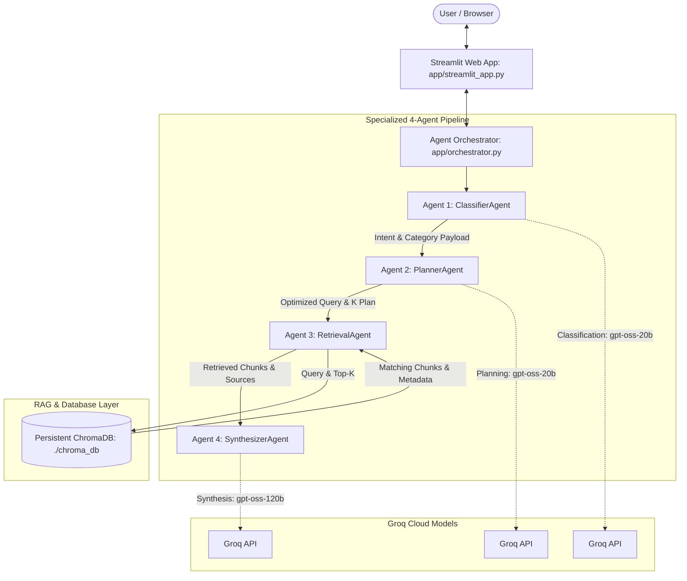
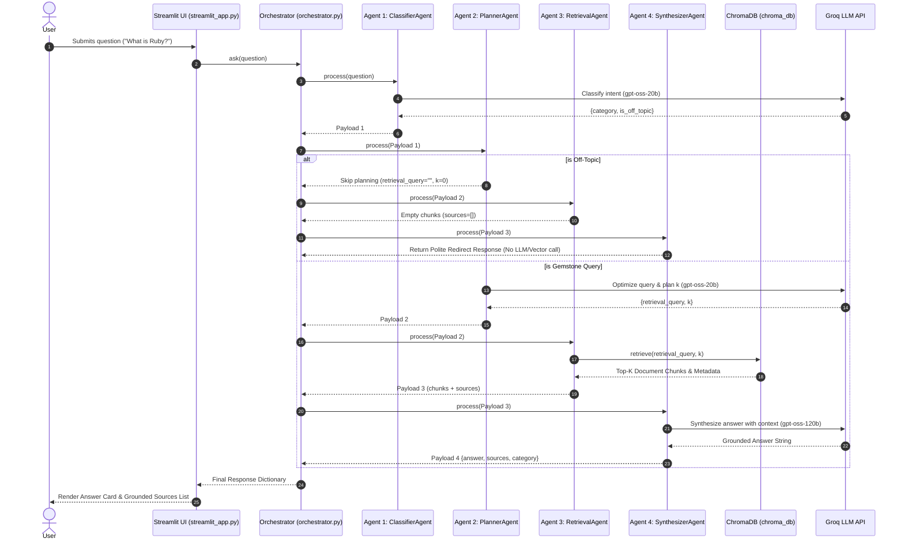

# Gemstone Knowledge Assistant

An Agentic AI RAG Application for Gemstone Domain Knowledge Retrieval, Classification, and Analysis.

---

## Project Description

The **Gemstone Knowledge Assistant** is an agentic Retrieval-Augmented Generation (RAG) system built for gemological domain question-answering. It leverages a specialized **4-Agent Architecture** (`ClassifierAgent`, `PlannerAgent`, `RetrievalAgent`, and `SynthesizerAgent`) powered by Groq LLMs and a persistent ChromaDB vector store containing 20 curated reference documents covering Rubies, Sapphires, Moonstones, and Sri Lankan gemology.

The system intelligently classifies user intent, formulates optimal vector search queries, fetches relevant text chunks, synthesizes grounded answers with document citations, and gracefully redirects off-topic questions without hallucinating.

---

## 4-Agent Architecture Diagram



---

## Setup Instructions

### Prerequisites
- Python 3.10+ installed
- Git installed

### Installation Steps

1. **Clone the Repository**:
   ```bash
   git clone https://github.com/Sajini2/Gemstone-Knowledge-Assistant-.git
   cd Gemstone-Knowledge-Assistant-
   ```

2. **Configure Environment Variables**:
   Copy `.env.example` to `.env` and set your Groq API Key:
   ```bash
   cp .env.example .env
   ```
   Edit `.env`:
   ```env
   GROQ_API_KEY=gsk_your_actual_groq_api_key_here
   ```

3. **Install Dependencies**:
   ```bash
   pip install -r requirements.txt
   ```

4. **Build the Vector Database Index**:
   ```bash
   python app/build_index.py
   ```

5. **Run Agent Test Suite**:
   ```bash
   python test_agents.py
   ```

6. **Launch the Streamlit Web Application**:
   ```bash
   python -m streamlit run app/streamlit_app.py
   ```

---

## Model Comparison Table

| Feature / Metric | Agent 1 & Agent 2: Routing & Planning (`openai/gpt-oss-20b`) | Agent 4: Answer Synthesis (`openai/gpt-oss-120b`) |
| :--- | :--- | :--- |
| **Primary Role** | Intent classification (`ruby`, `sapphire`, `moonstone`, `sri_lankan_gems`, `off_topic`), search query rewriting, and `k` planning | In-context synthesis, fact extraction, and source-grounded response generation |
| **Latency** | **Ultra-Low (~100-200 ms)** — Optimized for fast lightweight decision making | **Moderate (~500-800 ms)** — Balanced for complex multi-chunk reasoning |
| **Token Cost** | Extremely low resource footprint per request | Higher token capacity allocation for deep generation |
| **Context Window** | 8,192 tokens | 32,768 tokens (handles large retrieved context blocks) |
| **Reasoning Quality & Justification** | Ideal for deterministic JSON classification & structured parameter output without latency overhead | Superior multi-document synthesis, strict factual adherence, and minimal hallucination |

---

## 4-Agent Sequence Diagram



---

## RAG Pipeline Explanation

The RAG architecture converts 20 domain reference documents into an indexed vector knowledge base:

1. **Chunking Strategy**: Uses LangChain's `RecursiveCharacterTextSplitter` configured with `chunk_size=400` characters and `chunk_overlap=50` characters. This creates 106 distinct chunks, preserving sentence boundaries and context overlap across document splits.
2. **Embedding Model**: Employs sentence-transformers' `all-MiniLM-L6-v2` model executed locally via ChromaDB's ONNX runtime (`ONNXMiniLM_L6_V2`). Produces 384-dimensional embeddings locally with zero API cost.
3. **Vector Database**: Persists vector collections in `./chroma_db` using ChromaDB's `PersistentClient`.
4. **Retrieval Evaluation Summary**: Evaluated across 5 benchmark queries (`eval/retrieval_eval.py`), achieving 100% precision across source attribution and domain relevance:
   - **"What is Ruby?"** — Retrieves corundum composition, chromium trace elements, and Burmese/Thai origins (`ruby_geological_origin.txt`, `ruby_famous_rubies.txt`).
   - **"What is Sapphire?"** — Retrieves fancy corundum varieties, valence charge transfer, and valuation factors (`sapphire_color_varieties.txt`, `sapphire_valuation.txt`).
   - **"What is Moonstone?"** — Retrieves orthoclase-albite exsolution lamellae and adularescence physics (`moonstone_formation.txt`, `moonstone_adularescence.txt`).
   - **"What is Gem Certification?"** — Retrieves National Gem and Jewellery Authority (NGJA) laboratory testing standards (`sri_lankan_ngja_certification.txt`).
   - **"Which gems are found in Sri Lanka?"** — Retrieves Geuda sapphires, Alexandrite, Sinhalite, Spinel, and Ratnapura placer deposits (`sri_lankan_unique_species.txt`, `sri_lankan_ratnapura_region.txt`).

---

## Known Limitations

- **Domain Scope**: Specialized strictly for gemology; non-gemstone queries are politely redirected by design.
- **Local Persistence**: Vector database is stored locally in `./chroma_db`. Re-indexing is required if documents are modified.
- **API Dependency**: Final answer synthesis relies on active Groq API credentials.

---

## Live Streamlit App Demo

[Live Streamlit App Demo](https://gemstone-knowledge-assistant.streamlit.app)
