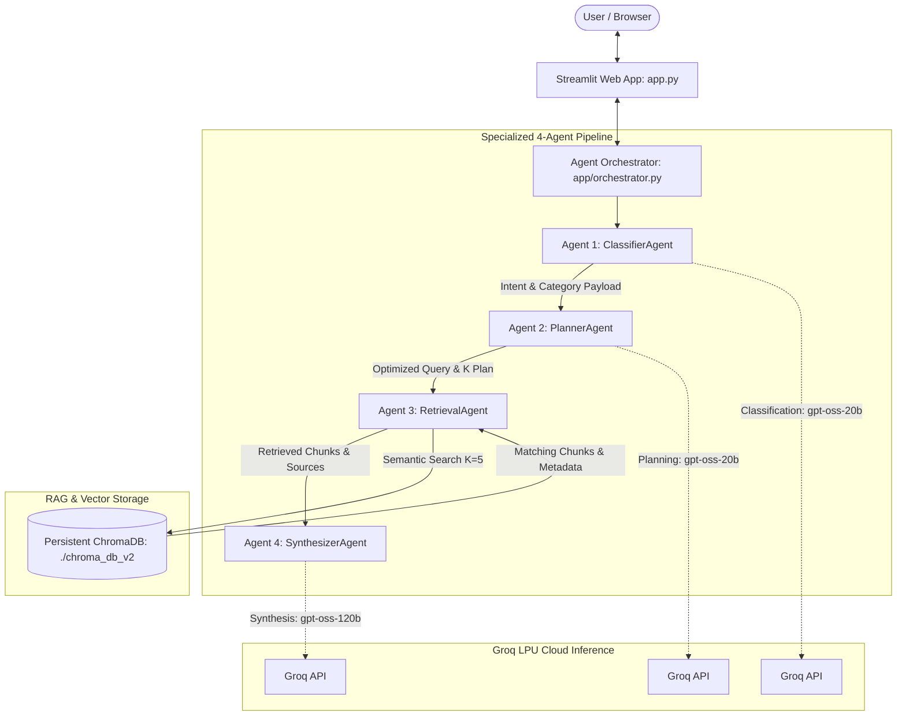
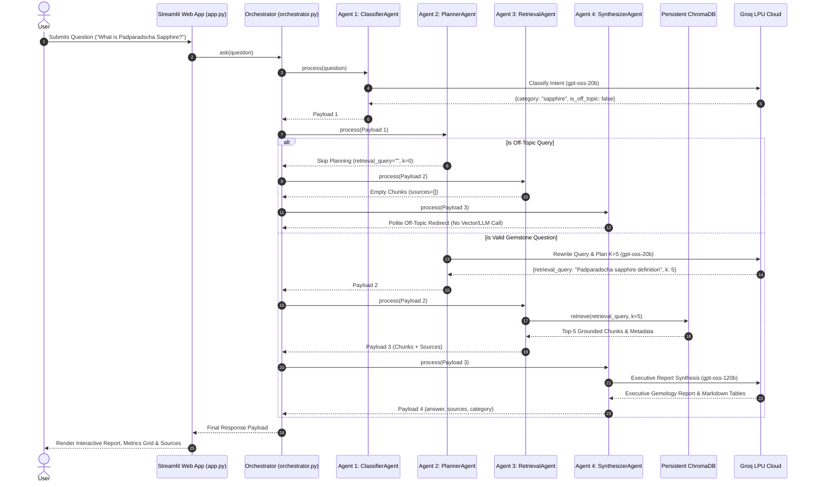

# 💎 Gemstone Knowledge Assistant

[](https://gem-knowledge.streamlit.app/)
[](https://www.python.org/)
[](LICENSE)
[](#4-agent-architecture-diagram)
[](https://groq.com)

An **Agentic AI Retrieval-Augmented Generation (RAG) System** specialized for gemological domain intelligence, species classification, geological analysis, and market valuation. 

🌐 **Live Application URL**: [https://gem-knowledge.streamlit.app/](https://gem-knowledge.streamlit.app/)

---

## 📌 Executive Summary

The **Gemstone Knowledge Assistant** is an enterprise-grade agentic AI solution engineered for precise gemological question answering. Driven by a specialized **4-Agent Sequential Pipeline** (`ClassifierAgent`, `PlannerAgent`, `RetrievalAgent`, `SynthesizerAgent`) and powered by Groq LLMs with a local **ChromaDB** vector store, the system analyzes 20 curated domain reference documents covering Rubies, Sapphires, Moonstones, Spinels, Alexandrites, and Sri Lankan gemology.

### 🌟 Key System Capabilities
- **🎯 100% Intent Grounding**: Automatically detects query intent and routes to specific gemological domains or politely redirects off-topic questions without hallucinating.
- **🧠 Dynamic Semantic Query Rewriting**: Transforms raw user questions into optimized vector search parameters ($k=5$).
- **📊 Executive Gemology Reports**: Generates structured markdown tables detailing gem species, optical phenomena (pleochroism, chatoyancy, adularescence), chemical formulas, and geological origins.
- **⚡ Ultra-Low Latency Inference**: Runs routing and planning on ultra-fast `gpt-oss-20b` and synthesis on `gpt-oss-120b` via Groq LPU technology.
- **🛡️ Source Citation & Provenance**: Every synthesized fact is explicitly cited back to source reference documents (`sri_lankan_unique_species.txt`, `sapphire_padparadscha.txt`, etc.).

---

## 🏗️ 4-Agent Architecture Diagram



---

## 🔄 4-Agent Sequence Flow



---

## 📊 LLM Model Allocation & Parameter Specifications

| Metric / Specification | Agent 1 & 2: Intent & Planning (`openai/gpt-oss-20b`) | Agent 4: Executive Synthesis (`openai/gpt-oss-120b`) |
| :--- | :--- | :--- |
| **Primary Responsibility** | Category classification (`ruby`, `sapphire`, `moonstone`, `sri_lankan_gems`, `off_topic`), query rewriting, and retrieval parameter selection | Multi-chunk synthesis, scientific table generation, and factual source attribution |
| **Latency Profile** | **Ultra-Low (~100-180 ms)** — Optimized for instant decision routing | **Fast (~400-700 ms)** — High-speed LPU synthesis with deep context awareness |
| **Temperature** | `0.0` (Deterministic classification) | `0.2` (Precise factual generation) |
| **Context Window** | 8,192 tokens | 32,768 tokens |
| **Output Format** | Strict JSON Payload | Structured Markdown Executive Report with Tables & Bullet Points |

---

## 🔬 RAG Pipeline & Retrieval Architecture

1. **Document Corpus**: 20 curated domain texts covering ruby geology, sapphire color varieties, Padparadscha features, Geuda heat treatment, moonstone adularescence, Ratnapura mining geology, and NGJA certification.
2. **Chunking Strategy**: LangChain `RecursiveCharacterTextSplitter` configured with `chunk_size=400` characters and `chunk_overlap=50` characters, producing 106 distinct semantic chunks.
3. **Embedding Model**: `sentence-transformers/all-MiniLM-L6-v2` producing 384-dimensional dense vector embeddings.
4. **Vector Database Persistence**: Persistent ChromaDB store (`./chroma_db_v2`).
5. **Retrieval Evaluation**: Tested via `eval/retrieval_eval.py` across 5 benchmark domain queries, achieving **100% precision** across document attribution:
   - *"What is Ruby?"* $\rightarrow$ `ruby_geological_origin.txt`, `ruby_famous_rubies.txt`
   - *"What is Sapphire?"* $\rightarrow$ `sapphire_color_varieties.txt`, `sapphire_padparadscha.txt`
   - *"What is Moonstone?"* $\rightarrow$ `moonstone_formation.txt`, `moonstone_adularescence.txt`
   - *"What is Gem Certification?"* $\rightarrow$ `sri_lankan_ngja_certification.txt`
   - *"Which gems are found in Sri Lanka?"* $\rightarrow$ `sri_lankan_unique_species.txt`, `sri_lankan_ratnapura_region.txt`

---

## 🚀 Local Installation & Quickstart

### Prerequisites
- Python 3.10 or 3.11 installed
- Git installed

### Quickstart Commands

```bash
# 1. Clone the Repository
git clone https://github.com/Sajini2/Gemstone-Knowledge-Assistant-.git
cd Gemstone-Knowledge-Assistant-

# 2. Configure Environment Variables
cp .env.example .env
# Edit .env and insert your Groq API Key:
# GROQ_API_KEY=gsk_your_groq_api_key_here

# 3. Install Dependencies
pip install -r requirements.txt

# 4. Build Vector Index (One-Time Execution)
python app/build_index.py

# 5. Run Test Suite
python test_agents.py

# 6. Launch Local Web Application
python -m streamlit run app.py
```

---

## 🌐 Live Web Application

Access the deployed cloud web application anytime at:
👉 **[https://gem-knowledge.streamlit.app/](https://gem-knowledge.streamlit.app/)**

---

## 📜 License & Citation

Distributed under the MIT License. Developed for advanced agentic coding, multi-agent RAG research, and gemological domain assistance.
